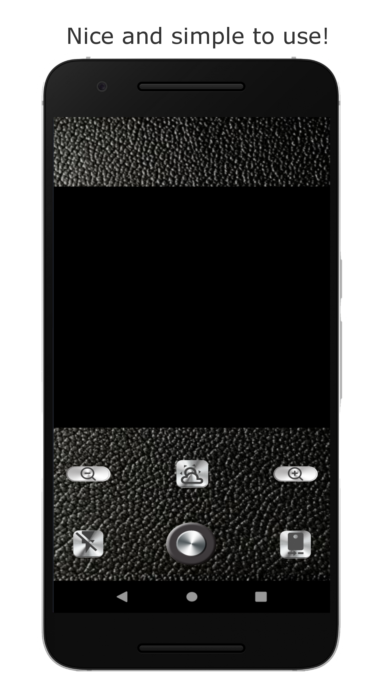

# vintageCam

Simple, nice and lightweight!

vintageCam is a very simple and easy to use phone camera app, that brings
back the look and feel of an old 6x6 film camera.
An aditional module with vintage filters is on its way!

### Screenshots

   

### Installation
If you want to try it out on your phone, do it with expo-client!

* Download Expo Client
   * [iOS](https://itunes.apple.com/app/apple-store/id982107779)
   * [Android](https://play.google.com/store/apps/details?id=host.exp.exponent&referrer=www)
* Scan the QR Code from [Expo.io](https://expo.io/@cesarvaldez/vintagecam) 

### Tech Stack
* React Native
* Expo

### Developer
Florian Jost [LinkedIn](https://www.linkedin.com/in/cesar-valdez-cervera/)
